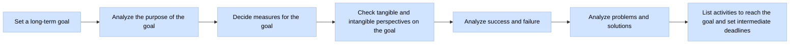

To select the long-term goal, follow these steps:

Start by identifying a skill that you want to master.
Identify at least ten different variations of that goal. Ask your family, friends, and colleagues for their suggestions.
Analyze the pros and cons of each variation. Based on that analysis, pick one goal and set a timeframe to achieve it. The timeframe can be as long as several years depending on what you want to achieve. However, selecting that goal date is important so that you can measure progress against that date.

Split this goal into sub-steps and set dates for these intermediate goals. Set incremental due dates for these goals.
Split these sub-steps into even smaller goals with shorter timeframes.
