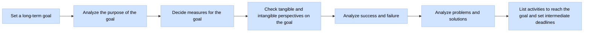

```mermaid
flowchart LR
    A[Set a long-term goal] --> B[Analyze the purpose of the goal]
    B --> C[Decide measures for the goal]
    C --> D[Check tangible and intangible perspectives on the goal]
    D --> E[Analyze success and failure]
    E --> F[Analyze problems and solutions]
    F --> G[List activities to reach the goal and set intermediate deadlines]

    classDef arrow fill:#d0e3ff,stroke:#a3bce6,color:#000,stroke-width:1px;
    class A,B,C,D,E,F,G arrow;
```
